# Import System Architecture: "Decoupled Streaming"

To solve the UI flickering issue reported by the stakeholders, the "Import School Accounts" system was upgraded from a simple loop to a **Decoupled Dual-Task Architecture**. 

This document explains the two simultaneous processes that happen when an import is triggered.

## 1. The Core Concept
The system now separates **"Doing the Work"** from **"Showing the Work"**. 

*   **Old Way**: Process 1 row → Update UI → Process 1 row → Update UI. (Slow and flickery).
*   **New Way**: Process rows as fast as possible in the background → Collect results in a "bucket" → Empty the bucket into the UI every 150ms. (Smooth and high-performance).

## 2. Technical Flow (Mermaid Diagram)

```mermaid
sequenceDiagram
    participant UI as React Frontend
    participant BT as Rust: Broadcast Task (The "Broadcaster")
    participant PT as Rust: Processor Task (The "Muscle")
    participant DB as PostgreSQL

    UI->>PT: Start Import (Tauri Command)
    PT->>PT: Open Database Transaction
    
    rect rgb(40, 40, 40)
        Note over BT, PT: These tasks run in PARALLEL
        loop Every 150ms
            BT->>BT: Check "Result Bucket"
            BT->>UI: Emit BATCHED Logs (JSON Array)
        end
        
        loop For each CSV Row
            PT->>DB: INSERT/UPDATE record
            PT->>PT: Push result to "Result Bucket"
            Note right of PT: Checks for PAUSE/STOP signals
        end
    end

    PT->>DB: COMMIT Transaction
    PT->>BT: Stop Broadcaster
    BT->>UI: Final "IMPORT COMPLETE" Signal
```

## 3. The Two Processes Explained

### Process A: The Processor Task ("The Muscle")
This is a dedicated background worker in Rust.
*   **Responsibility**: Reading the CSV, validating data, and talking to the Database.
*   **Speed**: It runs at maximum CPU speed. It doesn't wait for the UI to draw.
*   **Safety**: It manages the Database Transaction. If you click "Stop", it triggers a Rollback, ensuring no partial or "dirty" data is left in your system.

### Process B: The Flush/Broadcast Task ("The Traffic Cop")
This is a timer-based worker that runs every **150 milliseconds**.
*   **Responsibility**: It acts as a buffer. Instead of bombarding the UI with 500 messages per second, it collects them and sends one "digest" message.
*   **Visual Polish**: This is the process that fixed the flickering. By batching the updates, the browser's rendering engine (Chrome/WebView2) can keep up without getting overwhelmed.

## 4. Frontend Optimization (The Final Polish)
When the React frontend receives a batch of logs, it uses **`requestAnimationFrame` (rAF)**. 
*   This ensures that the UI only updates exactly when the computer monitor is ready to "paint" the next frame.
*   It prevents "Micro-Stuttering" and ensures that the progress bar moves smoothly even when importing 100,000+ records.

---

> [!NOTE]
> This dual-task approach is the industry standard for high-performance logging systems (similar to how Google Chrome's console or VS Code's terminal handles massive amounts of text).
