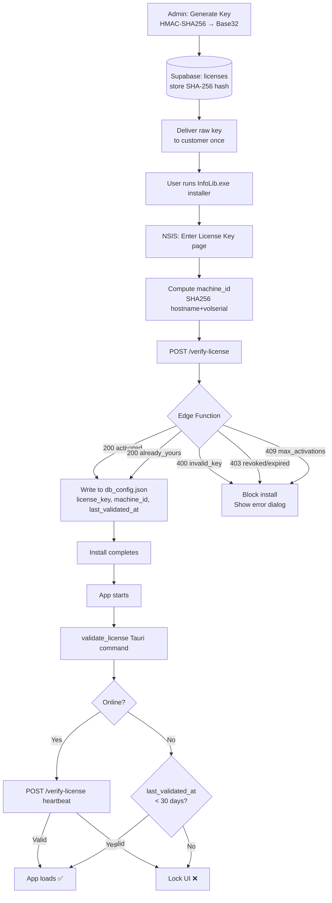

# InfoLib License Flow

**Author:** Senior Documentator (SD)
**Milestone:** M015 — Software License Activation
**Date:** 2026-05-09
**Status:** PROPOSED

---

## 1. Overview

InfoLib uses a **server-verified, machine-bound license key** system. The license is verified at **install time** (NSIS) and **runtime** (Tauri heartbeat). No key → no install. Revoked key → locked UI.

The key is never stored raw — only its `SHA-256` hash lives in Supabase.

---

## 2. License Key Format

```
INFL-ABCD1234-EFGH5678-IJKL9012
│    ├────────┴─────────┴──────── 24-char payload (3 × 8)
└─── Product prefix (fixed)

Total length: 29 characters
Alphabet:     ABCDEFGHJKLMNPQRSTUVWXYZ23456789
              (strips 0, O, I, 1 to avoid human-entry typos)
Entropy:      ~120 bits (24 chars × 5 bits)
```

Keys are generated **server-side only** using `HMAC-SHA256`.

---

## 3. Database Schema (Supabase / PostgreSQL)

### `licenses`
| Column | Type | Notes |
|---|---|---|
| `id` | UUID PK | `gen_random_uuid()` |
| `license_key_hash` | TEXT UNIQUE | `SHA-256(raw_key)` |
| `customer_email` | TEXT | Purchaser |
| `product_version` | TEXT | e.g. `v1.0` |
| `is_active` | BOOLEAN | `false` = revoked |
| `max_activations` | INTEGER | Default `1` |
| `expires_at` | TIMESTAMPTZ | `NULL` = perpetual |
| `notes` | TEXT | Admin notes |
| `created_at` | TIMESTAMPTZ | Auto |
| `updated_at` | TIMESTAMPTZ | Auto |

### `activations`
| Column | Type | Notes |
|---|---|---|
| `id` | UUID PK | `gen_random_uuid()` |
| `license_id` | UUID FK → licenses | Cascade delete |
| `machine_id` | TEXT | `SHA256(hostname+vol_serial)` |
| `machine_label` | TEXT | e.g. `GJC-PC-01` |
| `activated_at` | TIMESTAMPTZ | Auto |
| `last_validated_at` | TIMESTAMPTZ | Updated on heartbeat |

**Unique constraint**: `(license_id, machine_id)` — prevents double-counting same machine.

---

## 4. Supabase Edge Function: `verify-license`

**URL**: `POST https://gjtgotwduereuzpjiinw.supabase.co/functions/v1/verify-license`

### Request
```json
{
  "license_key":   "INFL-ABCD1234-EFGH5678-IJKL9012",
  "machine_id":    "a3f2c1...(sha256 hex)",
  "machine_label": "GJC-PC-01"
}
```

### Response Matrix
| HTTP | Body | Meaning |
|------|------|---------|
| 200 | `{ "status": "activated" }` | Newly activated |
| 200 | `{ "status": "already_yours" }` | Same machine, re-install safe |
| 400 | `{ "error": "invalid_key" }` | Key not in DB |
| 403 | `{ "error": "revoked" }` | `is_active = false` |
| 403 | `{ "error": "expired" }` | `expires_at` in past |
| 409 | `{ "error": "max_activations_reached" }` | Activation slot full |

### Edge Function Logic (Deno/TypeScript)
```typescript
// supabase/functions/verify-license/index.ts
import { serve } from "https://deno.land/std/http/server.ts";
import { createClient } from "https://esm.sh/@supabase/supabase-js";
import { crypto } from "https://deno.land/std/crypto/mod.ts";

serve(async (req) => {
  const { license_key, machine_id, machine_label } = await req.json();

  // 1. Hash the incoming key
  const keyHash = await hashSHA256(license_key);

  // 2. Look up in licenses table
  const supabase = createClient(
    Deno.env.get("SUPABASE_URL")!,
    Deno.env.get("SUPABASE_SERVICE_ROLE_KEY")!
  );
  const { data: license } = await supabase
    .from("licenses")
    .select("*")
    .eq("license_key_hash", keyHash)
    .single();

  if (!license) return json(400, { error: "invalid_key" });
  if (!license.is_active) return json(403, { error: "revoked" });
  if (license.expires_at && new Date(license.expires_at) < new Date())
    return json(403, { error: "expired" });

  // 3. Count existing activations
  const { count } = await supabase
    .from("activations")
    .select("*", { count: "exact" })
    .eq("license_id", license.id)
    .neq("machine_id", machine_id);

  if (count >= license.max_activations)
    return json(409, { error: "max_activations_reached" });

  // 4. Upsert activation (re-install safe)
  await supabase.from("activations").upsert({
    license_id: license.id,
    machine_id,
    machine_label,
    last_validated_at: new Date().toISOString(),
  }, { onConflict: "license_id,machine_id" });

  const isNew = count === 0;
  return json(200, { status: isNew ? "activated" : "already_yours" });
});
```

---

## 5. NSIS Install Flow

```
PREINSTALL Hook
│
├─ Show "Enter License Key" page (nsDialogs)
│   └─ GJC-branded header, text field, Validate button
│
├─ Collect machine_id
│   └─ PowerShell: SHA256(hostname + C:\ volume serial)
│
├─ POST to Edge Function (InetLoad plugin)
│
├─ Parse JSON response (nsJSON plugin)
│
├─ 200 activated / already_yours → SetVariable $LicenseValid = 1 → Continue
│
└─ 400 / 403 / 409 → MessageBox error → Abort installation
```

### NSIS snippet (key page)
```nsis
Page custom LicensePage LicensePageLeave

Function LicensePage
  nsDialogs::Create 1018
  Pop $Dialog
  ${NSD_CreateLabel} 0 0 100% 24u "Enter your InfoLib License Key:"
  ${NSD_CreateText} 0 30u 100% 14u ""
  Pop $LicenseField
  nsDialogs::Show
FunctionEnd

Function LicensePageLeave
  ${NSD_GetText} $LicenseField $LicenseKey
  ; collect machine_id via PowerShell
  nsExec::ExecToStack 'powershell -NoProfile -Command \
    "[Convert]::ToBase64String([System.Text.Encoding]::UTF8.GetBytes(\
    $env:COMPUTERNAME + (Get-WmiObject Win32_LogicalDisk -Filter DriveType=3 | \
    Select -First 1 VolumeSerialNumber).VolumeSerialNumber))" '
  Pop $ExitCode
  Pop $MachineId

  ; POST to Supabase Edge Function
  InetLoad::load /METHOD POST \
    /HEADER "Content-Type: application/json" \
    /DATA '{"license_key":"$LicenseKey","machine_id":"$MachineId","machine_label":"$COMPUTERNAME"}' \
    "https://gjtgotwduereuzpjiinw.supabase.co/functions/v1/verify-license" \
    "$TEMP\lic_response.json"

  ; Parse response
  nsJSON::Set /file "$TEMP\lic_response.json"
  nsJSON::Get "status" /END
  Pop $LicenseStatus

  ${If} $LicenseStatus == "activated"
  ${OrIf} $LicenseStatus == "already_yours"
    StrCpy $LicenseValid 1
  ${Else}
    nsJSON::Get "error" /END
    Pop $LicenseError
    MessageBox MB_OK|MB_ICONSTOP "License Error: $LicenseError$\nPlease contact support."
    Abort
  ${EndIf}
FunctionEnd
```

---

## 6. Config Persistence (`db_config.json`)

After successful activation, NSIS writes 3 new fields:
```json
{
  "database_url": "...",
  "pg_home": "...",
  "ollama_home": "...",
  "license_key": "INFL-ABCD1234-EFGH5678-IJKL9012",
  "machine_id": "a3f2c1...",
  "last_validated_at": "2026-05-09T11:52:00Z"
}
```

---

## 7. Runtime Heartbeat (Tauri / Rust)

On every app startup, `validate_license` command runs:

```rust
// src-tauri/src/commands/license.rs
#[tauri::command]
pub async fn validate_license(config: tauri::State<'_, AppConfig>) -> Result<bool, String> {
    let cfg = config.inner();
    let Some(ref key) = cfg.license_key else { return Err("no_license".into()) };
    let Some(ref machine_id) = cfg.machine_id else { return Err("no_machine_id".into()) };

    let client = reqwest::Client::new();
    let res = client.post("https://gjtgotwduereuzpjiinw.supabase.co/functions/v1/verify-license")
        .json(&serde_json::json!({ "license_key": key, "machine_id": machine_id }))
        .timeout(std::time::Duration::from_secs(10))
        .send().await;

    match res {
        Ok(r) if r.status().is_success() => {
            // update last_validated_at in db_config.json
            Ok(true)
        }
        Err(_) => {
            // offline: check 30-day grace
            let grace = cfg.last_validated_at
                .map(|t| chrono::Utc::now().signed_duration_since(t).num_days() < 30)
                .unwrap_or(false);
            Ok(grace)
        }
        _ => Ok(false),
    }
}
```

**Grace policy**: if offline and `last_validated_at` is within 30 days → allow. Otherwise lock UI with "License validation required — connect to internet."

---

## 8. Full Flow Diagram



---

## 9. Security Notes

| Threat | Mitigation |
|--------|-----------|
| Raw key extraction from binary | Key stored as SHA-256 hash only; raw key shown once at purchase |
| Anon key in NSIS binary | Edge Function is gatekeeper; anon key has no read access to `licenses` table |
| Key brute-force | 120-bit entropy + Supabase Edge rate limiting |
| Machine ID spoofing | Hardware-bound fingerprint; admin can audit `activations` table |
| License sharing | `max_activations = 1` enforced server-side; multi-seat available via admin override |

---

## 10. Decisions Registered

| ID | Decision |
|----|----------|
| D098 | Key format: `INFL-XXXXXXXX-XXXXXXXX-XXXXXXXX`, 29 chars, custom Base32 |
| D099 | Store SHA-256 hash in Supabase; never raw key |
| D100 | Machine binding: `SHA256(hostname + C:\ volume serial)` |
| D101 | Supabase Edge Function (Deno) is sole validation authority |
| D102 | 30-day offline grace via `last_validated_at` in `db_config.json` |
| D103 | NSIS plugins: `InetLoad` + `nsJSON` for HTTP + JSON in installer |
