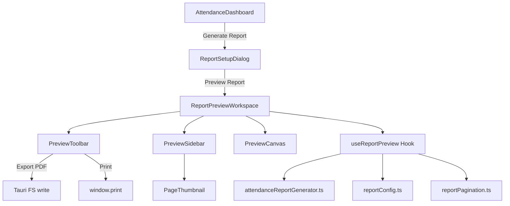

# M012-S05: Attendance Report Preview System

> **Milestone**: M012 (Attendance System) — Stage 05 (Report Preview)
> **Status**: 🟡 PLANNING
> **Priority**: HIGH (Boss-critical feature)

## 1. Objective

Replace current "blind export" flow (filter → save dialog → disk) with **live document preview workspace** that lets user see, configure, and refine attendance report **before** exporting to PDF. Experience should feel like professional design studio — orientation setup on entry, left settings panel, central document canvas, and top toolbar — all wrapped in InfoLib Win95/98 aesthetic.

---

## 2. User Flow

```
┌───────────────────────────────────────────────────────┐
│  1. User clicks "Generate Report" on Admin Dashboard  │
│                        ↓                              │
│  2. SETUP DIALOG appears (Orientation + Paper Size)   │
│     - Portrait / Landscape toggle                     │
│     - Paper: A4 / Letter / Legal                      │
│     - Date range & terminal filter (from old modal)   │
│     - [Preview Report] button                         │
│                        ↓                              │
│  3. Data fetched from backend                         │
│                        ↓                              │
│  4. PREVIEW WORKSPACE opens (fullscreen overlay)      │
│     ┌────────┬──────────────────┐                     │
│     │ LEFT   │   DOCUMENT       │                     │
│     │ PANEL  │   CANVAS         │                     │
│     │        │  (live preview)  │                     │
│     │ • Settings                │                     │
│     │ • Filters   ┌──────────┐ │                     │
│     │ • Stats     │  Page 1  │ │                     │
│     │ • Pages     │  ------  │ │                     │
│     │             │  Page 2  │ │                     │
│     │             └──────────┘ │                     │
│     └────────┴──────────────────┘                     │
│                        ↓                              │
│  5. User adjusts settings → canvas re-renders live    │
│                        ↓                              │
│  6. User clicks Export PDF / Print → final output     │
└───────────────────────────────────────────────────────┘
```

---

## 3. Component Architecture

### 3.1 File Structure

```
src/
├── components/
│   └── attendance/
│       ├── AttendanceDashboard.tsx          # existing — triggers report flow
│       ├── AttendanceReportModal.tsx        # REFACTOR → becomes Setup Dialog
│       └── report-preview/                 # NEW — all preview components
│           ├── ReportSetupDialog.tsx        # Step 1: orientation + filters
│           ├── ReportPreviewWorkspace.tsx   # Step 2: full preview layout
│           ├── PreviewToolbar.tsx           # Top toolbar (zoom, export, print)
│           ├── PreviewSidebar.tsx           # Left panel (settings, stats, pages)
│           ├── PreviewCanvas.tsx            # Central document renderer
│           ├── PageThumbnail.tsx            # Sidebar page thumbnail
│           └── types.ts                    # Shared types for preview system
├── utils/
│   ├── attendanceReportGenerator.ts        # EXTEND — add preview-mode rendering
│   ├── reportConfig.ts                     # NEW — shared paper/font/margin constants
│   └── reportPagination.ts                 # NEW — shared pagination logic
└── hooks/
    └── useReportPreview.ts                 # NEW — preview state management hook
```

### 3.2 Component Dependency Graph



---

## 4. Detailed Component Specs

### 4.1 `ReportSetupDialog` (Replaces current modal)

**Purpose**: Initial configuration before preview opens.

| Element | Type | Options | Default |
|---------|------|---------|---------|
| Orientation | Toggle | Portrait / Landscape | Portrait |
| Paper Size | Dropdown | A4, Letter, Legal | A4 |
| Date Range | Date inputs | From / To | Last 7 days |
| Terminal Filter | Dropdown | All / specific IDs | All |
| Presets | Buttons | Today, 7 Days, 30 Days | — |

**Actions**:
- `[Preview Report]` → fetch data → open `ReportPreviewWorkspace`
- `[Cancel]` → close dialog

**DRY Note**: Reuse existing date/terminal filter logic from `AttendanceReportModal.tsx`. Extract filter state into `useReportPreview` hook.

---

### 4.2 `ReportPreviewWorkspace` (Main Layout)

**Purpose**: Full-screen overlay containing three-panel layout.

```
┌─────────────────────────────────────────────────────────┐
│ [TitleBar: "Report Preview — Attendance Report"]    [X] │
├──────────────────────────────────────────────────────────┤
│ [PreviewToolbar]                                        │
│  Zoom: [-] 100% [+] | Orientation | Paper | Export | 🖨  │
├──────────┬──────────────────────────────────────────────┤
│          │                                              │
│ Preview  │         PreviewCanvas                        │
│ Sidebar  │                                              │
│          │    ┌─────────────────────┐                   │
│ ┌──────┐ │    │                     │                   │
│ │ P.1  │ │    │   [Page Content]    │                   │
│ │ ■■■  │ │    │                     │                   │
│ └──────┘ │    │   Header / Table    │                   │
│ ┌──────┐ │    │   / Footer          │                   │
│ │ P.2  │ │    │                     │                   │
│ │ ■■■  │ │    └─────────────────────┘                   │
│ └──────┘ │                                              │
│          │                                              │
│ ──────── │                                              │
│ Settings │                                              │
│ [Title]  │                                              │
│ [Margins]│                                              │
│ [Font sz]│                                              │
│          │                                              │
├──────────┴──────────────────────────────────────────────┤
│ Status: Page 1 of 3  |  245 records  |  Ready           │
└─────────────────────────────────────────────────────────┘
```

**Layout**: CSS Grid — `grid-template-columns: 220px 1fr`

**Z-index**: `z-[200]` (above all other modals)

---

### 4.3 `PreviewToolbar`

**Purpose**: Top action bar with document controls.

| Control | Type | Description |
|---------|------|-------------|
| Zoom Out | Button | Decrease zoom by 10% (min 25%) |
| Zoom Level | Display + Dropdown | 25%, 50%, 75%, 100%, 125%, 150%, Fit Width, Fit Page |
| Zoom In | Button | Increase zoom by 10% (max 200%) |
| Separator | — | — |
| Orientation | Toggle | Portrait ↔ Landscape (re-renders live) |
| Paper Size | Dropdown | A4 / Letter / Legal (re-renders live) |
| Separator | — | — |
| Export PDF | Button (Primary) | Save to disk via Tauri FS |
| Print | Button | `window.print()` with print stylesheet |
| Close | Button | Exit preview workspace |

**Style**: Win95 beveled toolbar with `shadow-bevel-raised` buttons.

---

### 4.4 `PreviewSidebar`

**Purpose**: Left panel with page navigation and document settings.

**Sections**:

#### A. Page Navigator (Top)
- Scrollable list of `PageThumbnail` components
- Click thumbnail → canvas scrolls to that page
- Active page highlighted with blue border

#### B. Document Settings (Middle)
- **Report Title**: Editable text input (default: "infoLib Attendance Report")
- **Show Header**: Checkbox (logo + title)
- **Show Footer**: Checkbox (page numbers)
- **Font Size**: Small / Medium / Large radio
- **Table Density**: Compact / Normal / Relaxed radio

#### C. Quick Stats (Bottom)
- Total Records: `{count}`
- Unique Students: `{count}`
- Date Range: `{start} → {end}`
- Pages: `{count}`

**Style**: `bg-classic-grey dark:bg-dark-panel` with `shadow-bevel-sunken` section dividers.

---

### 4.5 `PreviewCanvas`

**Purpose**: Central area rendering document pages at selected zoom level.

**Rendering Strategy**:
- Use **HTML/CSS rendering** (not jsPDF canvas) for live preview
- Mirror exact layout that jsPDF will produce (header, table, footer positions)
- Each page is `div` with dimensions matching paper size at 96 DPI:
  - A4 Portrait: `794px × 1123px`
  - A4 Landscape: `1123px × 794px`
  - Letter Portrait: `816px × 1056px`
  - Legal Portrait: `816px × 1344px`

**Page Rendering**:
```
┌─────────────────────────────────────┐
│  [Logo]  infoLib Attendance Report  │ ← Header
│  Period: 2026-05-01 to 2026-05-10  │
│  ─────────────────────────────────  │
│  Total: 245 | Unique: 89 | Gen: .. │
│                                     │
│  ┌────┬─────┬──────┬────┬────┬───┐ │
│  │Date│ID   │Name  │Crse│Rsn │Trm│ │ ← Table Header
│  ├────┼─────┼──────┼────┼────┼───┤ │
│  │... │...  │...   │... │... │...│ │ ← Data Rows
│  │... │...  │...   │... │... │...│ │
│  └────┴─────┴──────┴────┴────┴───┘ │
│                                     │
│       Page 1 of 3 — infoLib v1.0    │ ← Footer
└─────────────────────────────────────┘
```

**Interactivity**:
- Zoom: CSS `transform: scale({zoom})` with `transform-origin: top center`
- Scroll: Native overflow scroll on canvas container
- Background: `bg-[#808080] dark:bg-[#2A2A2A]` (neutral canvas background)
- Page shadow: `shadow-xl` to simulate paper on desk

---

### 4.6 `PageThumbnail`

**Purpose**: Miniature representation of each page in sidebar.

- Render at ~15% scale of actual page
- Show simplified content (colored blocks representing header/table/footer)
- Active page: `border-2 border-blue-500`
- Click: scroll canvas to corresponding page

---

## 5. State Management — `useReportPreview` Hook

```typescript
interface ReportPreviewState {
  // Setup
  orientation: 'portrait' | 'landscape';
  paperSize: 'a4' | 'letter' | 'legal';
  startDate: string;
  endDate: string;
  terminalId: string | null;

  // Data
  data: AttendanceLog[];
  isLoading: boolean;

  // Preview Settings
  zoom: number;           // 0.25 to 2.0
  currentPage: number;
  totalPages: number;
  reportTitle: string;
  showHeader: boolean;
  showFooter: boolean;
  fontSize: 'small' | 'medium' | 'large';
  tableDensity: 'compact' | 'normal' | 'relaxed';

  // Actions
  setOrientation: (o: 'portrait' | 'landscape') => void;
  setPaperSize: (s: 'a4' | 'letter' | 'legal') => void;
  setZoom: (z: number) => void;
  zoomIn: () => void;
  zoomOut: () => void;
  fitWidth: () => void;
  fitPage: () => void;
  goToPage: (page: number) => void;
  setReportTitle: (title: string) => void;
  setFontSize: (size: 'small' | 'medium' | 'large') => void;
  setTableDensity: (d: 'compact' | 'normal' | 'relaxed') => void;
  fetchData: () => Promise<void>;
  exportPDF: () => Promise<void>;
  print: () => void;
}
```

**DRY Principle**: This hook centralizes ALL preview state. Components only consume slices they need via destructuring. No duplicate state in child components.

---

## 6. Integration with Existing PDF Generator

### Current: `attendanceReportGenerator.ts`
- Generates jsPDF directly and returns `ArrayBuffer`
- Used for blind export

### Extension Strategy (DRY):
1. **Extract shared config** into `reportConfig.ts`:
   - Paper dimensions, margins, font sizes, colors
   - Used by BOTH HTML preview renderer AND jsPDF generator
2. **Shared pagination logic** into `reportPagination.ts`:
   - Calculate rows-per-page based on paper size + font size + density
   - Returns `{ pages: AttendanceLog[][], totalPages: number }`
3. **Keep jsPDF generator** for final export only
4. **HTML preview** uses SAME config + pagination to render identical layout

```
reportConfig.ts ──→ PreviewCanvas.tsx (HTML render)
       │
       └──────────→ attendanceReportGenerator.ts (jsPDF render)
```

Guarantees **WYSIWYG** — what you see in preview = what you get in PDF.

---

## 7. Paper Size Constants

```typescript
// utils/reportConfig.ts

export const PAPER_SIZES = {
  a4:     { width: 210, height: 297, label: 'A4' },
  letter: { width: 216, height: 279, label: 'Letter' },
  legal:  { width: 216, height: 356, label: 'Legal' },
} as const;

export const DEFAULT_MARGINS = { top: 20, right: 15, bottom: 15, left: 15 }; // mm

export const FONT_SIZES = {
  small:  { header: 18, subheader: 9, table: 7, footer: 6 },
  medium: { header: 22, subheader: 12, table: 9, footer: 8 },
  large:  { header: 26, subheader: 14, table: 11, footer: 10 },
} as const;

export const TABLE_DENSITY_ROW_HEIGHT = {
  compact:  5,   // mm
  normal:   7,   // mm
  relaxed:  10,  // mm
} as const;

// Convert mm to px at 96 DPI for HTML preview
export function mmToPx(mm: number): number {
  return Math.round(mm * 96 / 25.4);
}
```

---

## 8. Styling Guidelines

### Win95/98 Aesthetic Adaptation
- **Toolbar**: `bg-classic-grey dark:bg-dark-surface` with beveled button borders
- **Sidebar**: `bg-classic-grey dark:bg-dark-panel` with sunken sections
- **Canvas background**: `bg-[#808080] dark:bg-[#2A2A2A]` (neutral gray, like design app canvas)
- **Page paper**: `bg-white shadow-xl` (paper-on-desk effect)
- **Active thumbnail**: `border-2 border-[#000080]` (Win95 selection blue)
- **Status bar**: Classic Win95 status bar at bottom with sunken fields

### Dark Mode
All components MUST support dark mode using existing `dark:` Tailwind variants. Document canvas (paper) stays white in both modes — only surrounding chrome adapts.

---

## 9. Performance Considerations

1. **Lazy page rendering**: Only render visible pages + 1 above/below
2. **Debounced settings**: Setting changes (font size, density) debounced 200ms before re-render
3. **Memoized pagination**: `useMemo` on pagination calculation — only recalculates when data/settings change
4. **Virtualized thumbnails**: If > 20 pages, virtualize sidebar thumbnail list
5. **Export runs in `requestIdleCallback`**: PDF generation doesn't block UI

---

## 10. Keyboard Shortcuts

| Shortcut | Action |
|----------|--------|
| `Ctrl + P` | Print |
| `Ctrl + S` | Export PDF |
| `Ctrl + +` | Zoom In |
| `Ctrl + -` | Zoom Out |
| `Ctrl + 0` | Reset Zoom (100%) |
| `←` / `→` | Previous / Next Page |
| `Escape` | Close Preview |

---

## 11. Dependencies

| Package | Purpose | Status |
|---------|---------|--------|
| `jspdf` | PDF generation (export only) | ✅ Already installed |
| `jspdf-autotable` | Table rendering in PDF | ✅ Already installed |
| `date-fns` | Date formatting | ✅ Already installed |
| `lucide-react` | Icons | ✅ Already installed |
| `@tauri-apps/plugin-fs` | File save | ✅ Already installed |
| `@tauri-apps/plugin-dialog` | Save dialog | ✅ Already installed |

**No new dependencies needed.** Everything builds on existing stack.

---

## 12. Implementation Order

| Task | Description | Effort | Depends On |
|------|-------------|--------|------------|
| T01 | Create `types.ts` + `reportConfig.ts` (shared constants) | S | — |
| T02 | Create `reportPagination.ts` (shared pagination logic) | S | T01 |
| T03 | Create `useReportPreview` hook | M | T01, T02 |
| T04 | Refactor `AttendanceReportModal` → `ReportSetupDialog` | S | T01 |
| T05 | Build `PreviewCanvas` (HTML page renderer) | L | T01, T03 |
| T06 | Build `PreviewToolbar` | M | T03 |
| T07 | Build `PreviewSidebar` + `PageThumbnail` | M | T03, T05 |
| T08 | Build `ReportPreviewWorkspace` (assembles all) | M | T04-T07 |
| T09 | Wire into `AttendanceDashboard` | S | T08 |
| T10 | Refactor `attendanceReportGenerator.ts` to use shared config | M | T01 |
| T11 | QA: verify WYSIWYG parity (preview vs exported PDF) | M | T05, T10 |

**S** = Small (< 1hr), **M** = Medium (1-3hr), **L** = Large (3-5hr)

---

## 13. Acceptance Criteria

- [ ] Setup dialog shows orientation + paper size selection before preview
- [ ] Preview workspace opens fullscreen with 3-panel layout
- [ ] Left sidebar shows page thumbnails, settings, and stats
- [ ] Top toolbar has zoom, orientation, paper size, export, and print controls
- [ ] Document canvas renders pages at correct paper dimensions
- [ ] Changing orientation/paper size re-renders live
- [ ] Changing font size / density re-renders live
- [ ] Page thumbnails update when settings change
- [ ] Exported PDF matches preview layout (WYSIWYG)
- [ ] Dark mode fully supported
- [ ] Keyboard shortcuts functional
- [ ] No new npm dependencies required

---

*Last Updated: 2026-05-10 by LPM Agent*
