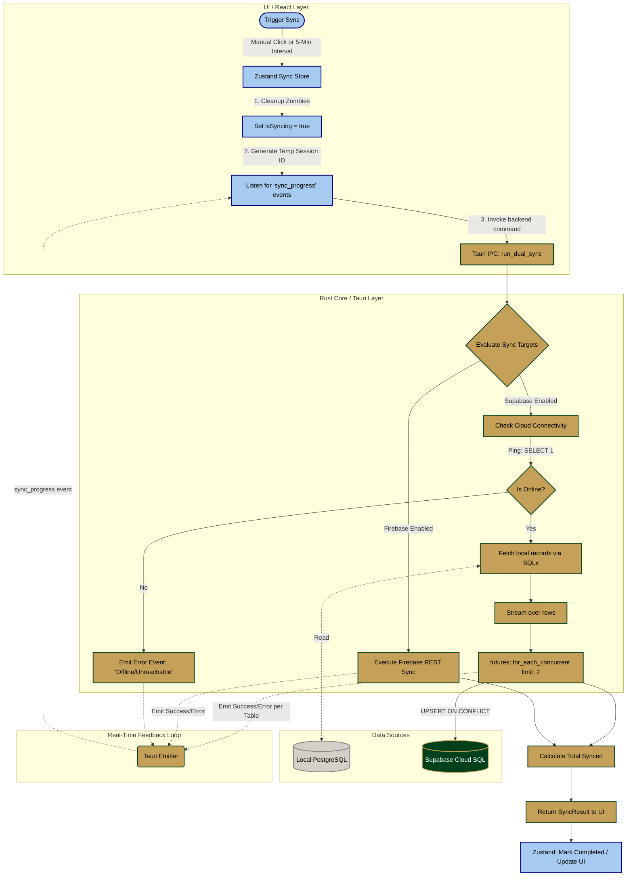

# Dual Synchronization Architecture Flow

This document outlines the complete, end-to-end data flow for the infoLib Dual Synchronization engine. It details how data moves from the local database instance to the targeted cloud providers (Supabase and/or Firebase) while providing real-time feedback to the user interface.

## System Architecture Flowchart

The following diagram illustrates the complete synchronization lifecycle, from trigger to completion.

## Step-by-Step Breakdown

### 1. The Trigger (Frontend)
The process begins when a user clicks **"Sync Now"** in the `SyncLogsDialog`, or when the **5-minute background Auto-Sync** interval fires.
* The `syncStore` (Zustand) intercepts the request.
* **Zombie Cleanup**: Before doing anything, it scans for any old processes that were stuck in a "syncing" state (due to an app crash or force quit) and forces them to a "failed" state.
* The UI sets `isSyncing = true`, rendering a single blue loading spinner exclusively on the top-most active log entry.

### 2. The Orchestrator (Tauri IPC)
The frontend sends an asynchronous payload to the Rust backend: `invoke('run_dual_sync', { targets })`.
* Rust generates a unique millisecond-precision `session_id`.
* The `app.emit()` channel is opened to stream logs back to the frontend in real-time.

### 3. Validation & Offline Checking (Rust)
Before attempting any heavy data lifting, Rust checks the requested targets.
* **Supabase Path**: The backend executes a lightweight `SELECT 1` query against the Supabase cloud connection pool.
    * If the internet is down or the server is unreachable, it instantly fails the process gracefully.
    * This guarantees the application will never lock up or freeze trying to process data while offline.

### 4. Concurrent Cloud Streaming (Data Execution)
Once connectivity is verified, the system processes tables sequentially based on Foreign Key dependencies (e.g., `tblAuthor` before `tblMaterial`).
* For each table, the exact local row state is fetched.
* **Concurrency Engine**: Rust utilizes `futures_util::stream` to process the rows.
    * It pushes the data to the cloud at a concurrency limit of **2 threads**.
    * *Why 2 threads?* It provides a balance between high-speed batching and strict hardware safety, preventing PostgreSQL connection pool exhaustion and preventing the user's PC from crashing under load.
* Data is inserted into the cloud using an `INSERT ... ON CONFLICT (...) DO UPDATE` SQL command. This means records are dynamically updated if they exist, or cleanly inserted if they are new.

### 5. Resolution & UI Polish
As tables complete, Rust emits event logs (`info`, `success`, `error`) across the IPC channel. The React frontend catches these payloads and expands the accordion logs in real-time.
* Once all targets resolve, Rust returns the final aggregated `SyncResult`.
* The `syncStore` saves the execution timestamp, drops the blue loading spinner into a green "Completed" checkmark, and closes the active session.
