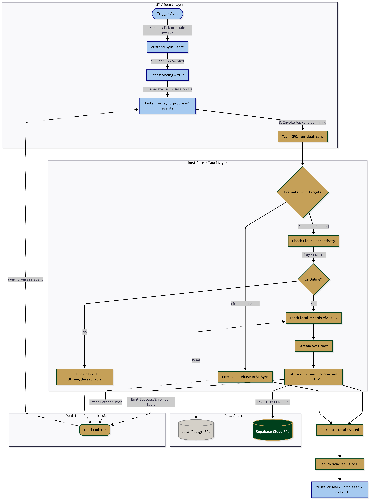

# Dual Synchronization Architecture Flow

This document outlines the complete, end-to-end data flow for the infoLib Dual Synchronization engine. It details how data moves from the local database instance to the targeted cloud providers (Supabase and/or Firebase) while providing real-time feedback to the user interface.

## System Architecture Flowchart

The following diagram illustrates the complete synchronization lifecycle, from trigger to completion.

## Step-by-Step Breakdown

### 1. The Trigger (Frontend)
The process begins in one of two ways:
* **Manual**: The user clicks **"Sync Now"** in the `SyncLogsDialog`.
* **Scheduled**: The **Admin-Configured Auto-Sync Scheduler** fires at the designated time and day (see Section 6 below).

Regardless of trigger source:
* The `syncStore` (Zustand) intercepts the request.
* **Zombie Cleanup**: Before doing anything, it scans for any old processes that were stuck in a "syncing" state (due to an app crash or force quit) and forces them to a "failed" state.
* The UI sets `isSyncing = true`, rendering a single blue loading spinner exclusively on the top-most active log entry.

### 2. The Orchestrator (Tauri IPC)
The frontend sends an asynchronous payload to the Rust backend: `invoke('run_dual_sync', { targets })`.
* Rust generates a unique millisecond-precision `session_id`.
* The `app.emit()` channel is opened to stream logs back to the frontend in real-time.

### 3. Validation & Offline Checking (Rust)
Before attempting any heavy data lifting, Rust checks the requested targets.
* **Supabase Path**: The backend executes a lightweight `SELECT 1` query against the Supabase cloud connection pool.
    * If the internet is down or the server is unreachable, it instantly fails the process gracefully.
    * This guarantees the application will never lock up or freeze trying to process data while offline.

### 4. Concurrent Cloud Streaming (Data Execution)
Once connectivity is verified, the system processes tables sequentially based on Foreign Key dependencies (e.g., `tblAuthor` before `tblMaterial`).
* For each table, the exact local row state is fetched.
* **Concurrency Engine**: Rust utilizes `futures_util::stream` to process the rows.
    * It pushes the data to the cloud at a concurrency limit of **2 threads**.
    * *Why 2 threads?* It provides a balance between high-speed batching and strict hardware safety, preventing PostgreSQL connection pool exhaustion and preventing the user's PC from crashing under load.
* Data is inserted into the cloud using an `INSERT ... ON CONFLICT ("Accession") DO UPDATE` SQL command. This is an **"Upsert"** logic that ensures data integrity:
    * **Conflict Detection**: If a record with the same unique identifier (e.g., `Accession`) already exists in the cloud, the engine prevents a crash and instead performs a surgical update of all fields (`Location`, `Status`, `DueDate`, etc.).
    * **State Verification**: If the record is new, it is inserted cleanly. If the existing cloud record is already identical to the local state, logs may show `rows_affected=0`, signifying that the system successfully verified the mirror without needing to write redundant data.

### 5. Resolution & UI Polish
As tables complete, Rust emits event logs (`info`, `success`, `error`) across the IPC channel. The React frontend catches these payloads and expands the accordion logs in real-time.
* Once all targets resolve, Rust returns the final aggregated `SyncResult`.
* The `syncStore` saves the execution timestamp, drops the blue loading spinner into a green "Completed" checkmark, and closes the active session.

---

## Admin-Configured Sync Scheduler (Section 6)

The system supports a fully configurable, admin-managed sync schedule. This replaces the previous hardcoded 5-minute interval with an intelligent, time-aware scheduler.

### Configuration (Settings → Database → Auto-Sync Schedule)
| Setting | Description | Default |
|---------|-------------|---------|
| **Sync Time** | The exact time (24h format) to trigger auto-sync | `16:00` |
| **Frequency Mode** | `Everyday` (runs daily) or `Custom Days` (runs only on selected days) | `Everyday` |
| **Selected Days** | When in Custom mode, the specific days of the week to run (Mon-Sun) | N/A |

### How It Works
1. A **60-second polling loop** runs inside `MainLayout.tsx`. Every tick, it:
    * Reads the current system time.
    * Compares it against the admin-configured `schedule.time`.
    * Checks if today's day-of-week is an active sync day (based on `mode` and `selectedDays`).
2. If all conditions are met **and** the sync has not already fired today, the scheduler triggers `syncNow()`.
3. A `lastScheduledFire` ref (keyed by date) ensures **exactly one sync per eligible day**.

### Silent Reset Behavior
When the admin saves new schedule settings in the Settings dialog:
* The `schedule` object in `syncStore` is updated immediately.
* Because `MainLayout`'s `useEffect` has `schedule` in its dependency array, the polling loop **silently tears down and restarts** with the new configuration — no app restart required.

### Failure Scenarios
| Scenario | System Behavior |
|----------|----------------|
| **No Internet** | Supabase `SELECT 1` ping fails → session logged as `failed` with reason |
| **Power Loss / PC Crash** | On next app launch, zombie cleanup marks the interrupted session as `failed` |
| **App Not Running at Scheduled Time** | The scheduler checks `currentTime >= schedule.time` on mount, so if the app is opened later that day, it will still fire the missed sync |
| **Admin Changes Schedule Mid-Day** | Silent reset picks up the new time immediately; if the new time has already passed today, it fires once |

### TODO: Auto Email Notifications
> 📧 **Planned Feature**: Automatic email alerts for sync activity will be implemented in a future milestone. The system will send daily/weekly digest emails to the admin containing:
> * Sync success/failure status per day
> * Skipped days (when the app was not running)
> * Error details for failed sync attempts
> * Summary of records synced per target (Firebase/Supabase)
